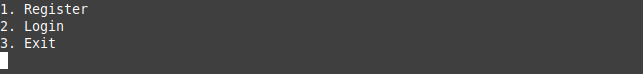
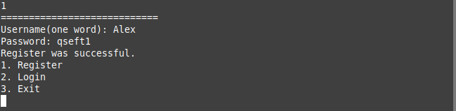
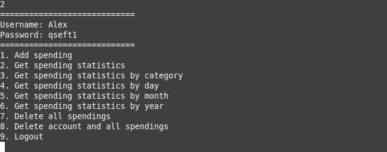
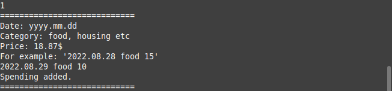
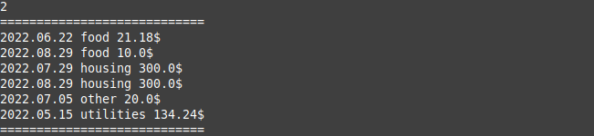
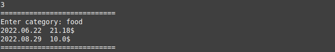
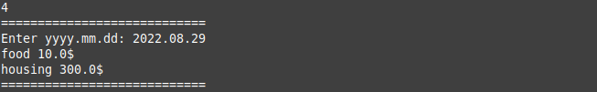
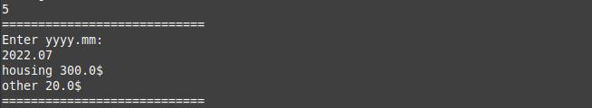
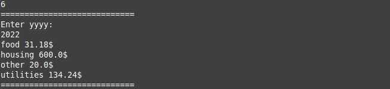
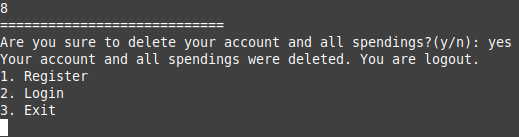

# A simple program for cost accounting and statistics

## Description

The application could use by different users whose pass register. After log in, each of them could add spending and get their spending statistics differently. The user can delete all spendings and also account with all data. All data is saved in a database.

## How to use it

If the app launches, you will see it. To choose a command enter number that you need.

Now, we need to pass the register, let's enter '1' and fill out the rows.

If you already have an account try to log in.

Let's add spending.

To show how spending statistics work, I add some spendings. Getting statistics.

To get spending statistics by category, choose the command and enter the category. Others command for getting statistics the similar.

To delete all spendings from your account use the seventh command and confirm deleting.

You can also delete an account using the appropriate command, after which you will be automatically logged out. To just log out, take the last command.

__Thanks for watching!__

